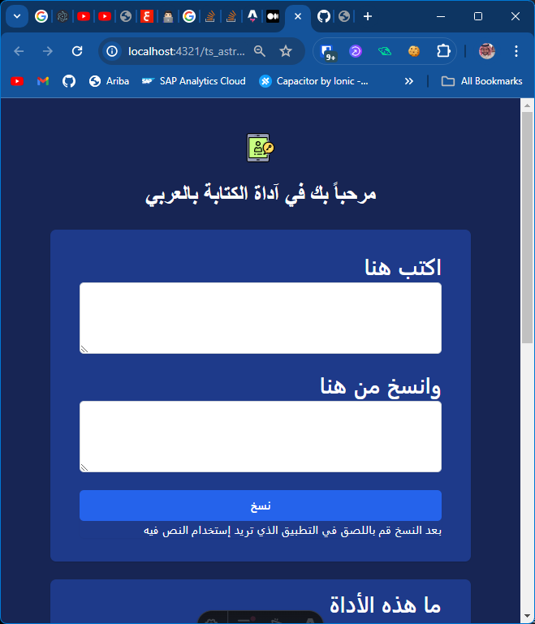

# Arabic Reverse Typing

This is a simple web app that allows you to type in Arabic in reverse order to use in non-arabic supported applications.

## How to use

1. Visit the [Arabic Reverse Typing](https://mo9a7i.github.io/ts_astro_arabic_reverse_typing/) website.
2. Type in the text you want to reverse in the input field.
3. Click the "copy" button.
4. Paste in the application you want

## License

Non licensed. Feel free to use and modify the code as you wish.
